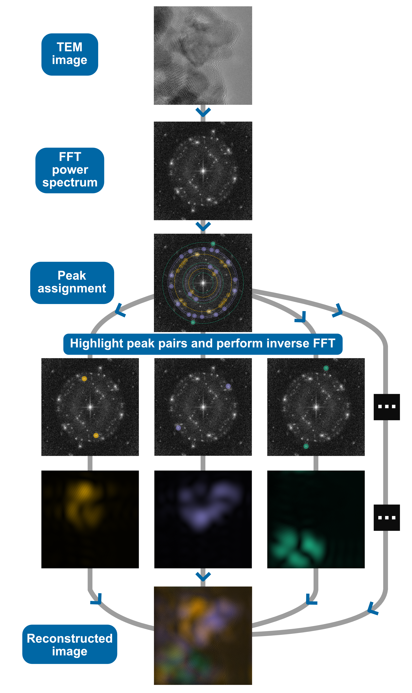

# Visualization of Co3O4 facets in TEM images by FFT

See the original paper:

[*Fluoride Substitution: Quantifying Surface Hydroxyls of Metal Oxides with Fluoride Ions*](https://doi.org/10.1002/admi.202400237)

---
This repository contains the code used for visualizing Co3O4 facets by performing FFT on TEM images.

See `Co3O4_0pass.ipynb` and `Co3O4_5pass.ipynb` for the code implementation.

There are 4 main steps involved:

**Fast Fourier transform (FFT)**: First, FFT is applied to the TEM image with a properly calibrated nm/pixel scale. The brightness and contrast are adjusted to better visualize the spots in the FFT power spectrum. Each peak in the power spectrum corresponds to regularly repeating lattice fringes with a specific d-spacing in the real space.

**Peak assignment**: The centrosymmetric peak pairs are manually picked from the FFT power spectrum. For each peak, the distance to the origin is calculated, representing the inverse d-spacing. To reduce errors, the average distance to the origin is taken for each peak pair. The reciprocal of the inverse d-spacing yields the d-spacing of lattice fringes. The peak pairs are assigned to specific crystal planes by comparing them to the d-spacings of a Co3O4 reference (ICSD 36256). Peaks are assigned with a tolerance of 0.015 nm in d-spacing. We classify them into three main groups: green for (100)/(200)/(400), yellow for (110)/(220), and purple for (111)/(222)/(311). Since the d-spacings of (222) and (311) are similar (0.233 nm and 0.243 nm respectively), they are not further distinguished and are considered in the same class here. Peaks beyond the threshold of 0.015 nm are unassigned, marked in white and are not involved in further processing.

**Inverse FFT and color mapping**: After peak assignment, each peak pair is highlighted individually in the FFT power spectrum and subjected to an inverse FFT. This results in real-space images with regions corresponding to the origin of each peak pair. These regions are then colored according to the facet-specific scheme mentioned above.

**Image reconstruction**: This process is repeated for all peak pairs, and the colored images are stacked together to reconstruct the TEM image. The resulting image uses false colors to visualize facets with distinct lattice fringes.

